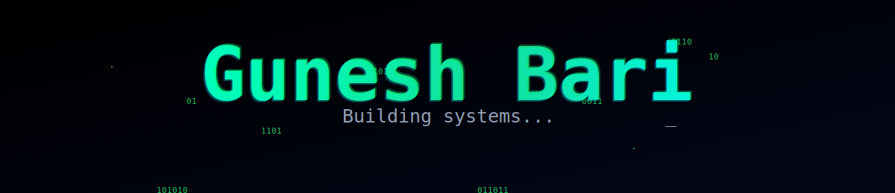

  

## ⚔️ TECH ARSENAL

<table align="center">
  <tr>
    <th align="center"><b>Category</b></th>
    <th align="center"><b>Technologies</b></th>
    <th align="center"><b>Proficiency</b></th>
  </tr>

  <!-- LANGUAGES -->
  <tr>
    <td align="center"><b>🔤 Languages</b></td>
    <td>
      
    </td>
    <td align="center">
       
      
    </td>
  </tr>

  <!-- FRONTEND -->
  <tr>
    <td align="center"><b>🖥️ Frontend</b></td>
    <td>
      
    </td>
    <td align="center">
       
      
    </td>
  </tr>

  <!-- BACKEND -->
  <tr>
    <td align="center"><b>⚙️ Backend</b></td>
    <td>
      
    </td>
    <td align="center">
       
      
    </td>
  </tr>

  <!-- DATABASES -->
  <tr>
    <td align="center"><b>🗄️ Databases</b></td>
    <td>
      
    </td>
    <td align="center">
       
      
    </td>
  </tr>

  <!-- DEVOPS & INFRA -->
  <tr>
    <td align="center"><b>☁️ DevOps & Infra</b></td>
    <td>
      
    </td>
    <td align="center">
       
      
    </td>
  </tr>

  <!-- MONITORING -->
  <tr>
    <td align="center"><b>📊 Monitoring</b></td>
    <td>
      
    </td>
    <td align="center">
       
      
    </td>
  </tr>

  <!-- AI/ML -->
  <tr>
    <td align="center"><b>🤖 AI/ML</b></td>
    <td>
      
    </td>
    <td align="center">
       
      
    </td>
  </tr>

  <!-- DEVELOPMENT ENV-->
  <tr>
    <td align="center"><b>🛠️ Development Environment</b></td>
    <td>
      
    </td>
    <td align="center">
       
      
    </td>
  </tr>
</table>

---

## 📊 MATCH STATS

### 📈 Contribution Graph

### 📊 Detailed Analytics

### 🏆 Profile Stats

---

## 🚀 ACTIVE QUEST LOG

| 🎯 | Project | Description |
|:---:|:---|:---|
| 🔐 | **[SentinelCore_DEV](https://github.com/Guneshbari/SentinelCore_DEV)** | Security platform — actively in dev |
| 🤖 | **[mock-mentor](https://github.com/Guneshbari/mock-mentor)** | AI-powered mock interview engine |
| 🚛 | **[FleetFlow](https://github.com/Guneshbari/FleetFlow-Modular-Fleet-Logistics-Management-System)** | Modular fleet logistics · 4-role RBAC |
| 📊 | **[data-analysis](https://github.com/Guneshbari/data-analysis)** | Data science notebooks — EDA & preprocessing |
| 🐧 | **[arch-dotfiles](https://github.com/Guneshbari/arch-dotfiles)** | Omarchy + WSL2 Arch Linux daily driver config |

---

## 🎯 CURRENT FOCUS

| 🌱 Grinding | 📚 Exploring | 💬 Ask Me |
|:---:|:---:|:---:|
| LangChain · LLM tooling · n8n | Distributed systems · MLOps | Flask/Node arch · Linux setup · Kafka |

---

## 💭 LORE

> *"The unexamined codebase is not worth maintaining."*
> — inspired by Socrates, probably

Great software is **philosophy made executable** — every architectural decision is a bet on what matters. I build with that weight in mind.

---

## 🤝 JOIN MY PARTY

*Open to collabs, side quests, and conversations worth having.*

Mumbai · India

